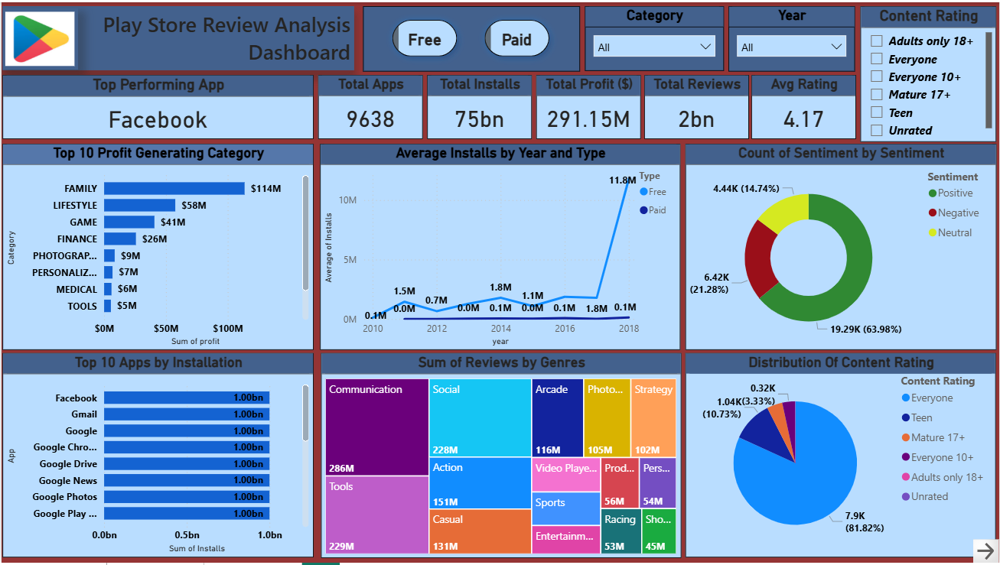
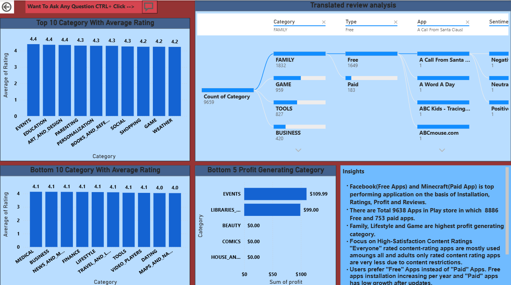

# 📊 Playstore Review Analysis Dashboard (Power BI)

## 📝 Project Overview
This project analyzes Playstore apps data along with user reviews using **Power BI**.  
The goal of the dashboard is to uncover insights about:
- Most popular app  
- App ratings and reviews trends  
- Installation distribution  
- Pricing and revenue opportunities  
- User sentiments from reviews  

---

## ❓ Key Questions
- Which app is the top performer?  
- Which top categories are generating the highest profit?  
- Which are the top apps with the highest installations?  
- Which type of apps are users preferring the most: Free or Paid?  
- What are the positive and negative reviews?  

---

## Insights
- Top Performing Apps:Facebook (Free App) and Minecraft (Paid App) are leading performers based on Installations, Ratings, Profit, and User Reviews.
- User Preference (Free vs Paid):
   - Free apps show consistent year-on-year growth in installations.
   - Paid apps display limited adoption and slower growth, even after updates.
- Free apps has avg rating 4.17 and Paid Apps has avg rating 4.24
- Family, Lifestyle, and Game categories generate the highest profits.

---

## 📂 Repository Structure
Playstore_Review_Analysis_Dashboard/
│
├── Dashboard/
│   └── Playstore_review_analysis_dashboard_powerbi.pbix
│
├── Datasets/
│   ├── Playstore_data.csv
│   └── User_Reviews.csv
│
├── Images/
│   ├── Dashboard_Page1.png
│   └── Dashboard_Page2.png
│
│── Video/
│    └── playstore_review_analysis_video.mp4
└─ README.md

---

## 📊 Dashboard Preview
Here is images of the Power BI dashboard:  

---

## 🎥 Demo Video
You can watch a quick demo of the dashboard here:
👉 [Demo Video Link](https://drive.google.com/file/d/1CcMYWqkNsGBsnxQBWv66wAzMcYZb0qqg/view?usp=drive_link)

---

## ⚙️ Tools & Technologies
- **Power BI** → Dashboard development  
- **Power BI Query Editor** → Data cleaning,Transform & preparation  
- **DAX** → Calculations & measures  
- **Visualization techniques** → Interactive charts, KPIs  

---

## 📑 Datasets
- **Playstore Data** → Contains details about apps (category, installs, ratings, etc.)  
- **User Reviews Data** → Contains reviews and sentiments (positive, negative, neutral)  

---

## 🚀 How to Run

- Clone this repository.
- Open Dashboard/Playstore_review_analysis_dashboard_powerbi.pbix in Power BI Desktop.
- Connect datasets from Datasets/ (if not already linked).
- Explore interactive visuals & KPIs.

---

## 👤 Author

Priyank Shrivastava
📧 Email: priyankshrivastava5678@gmail.com